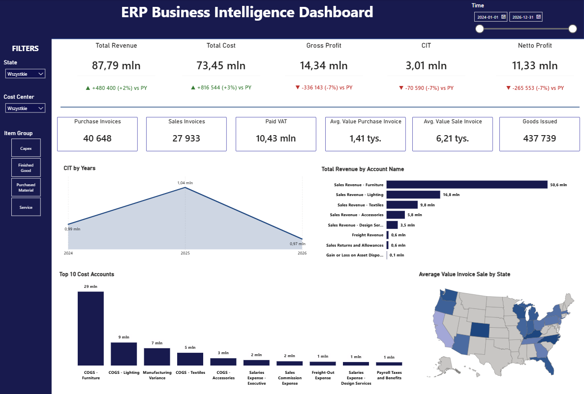
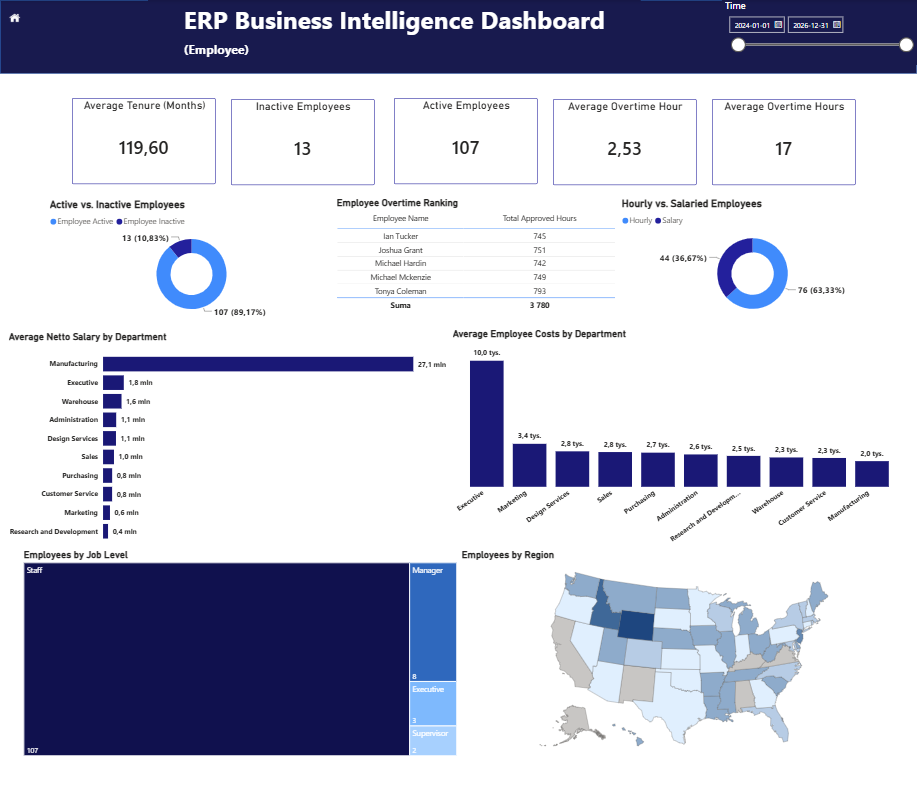
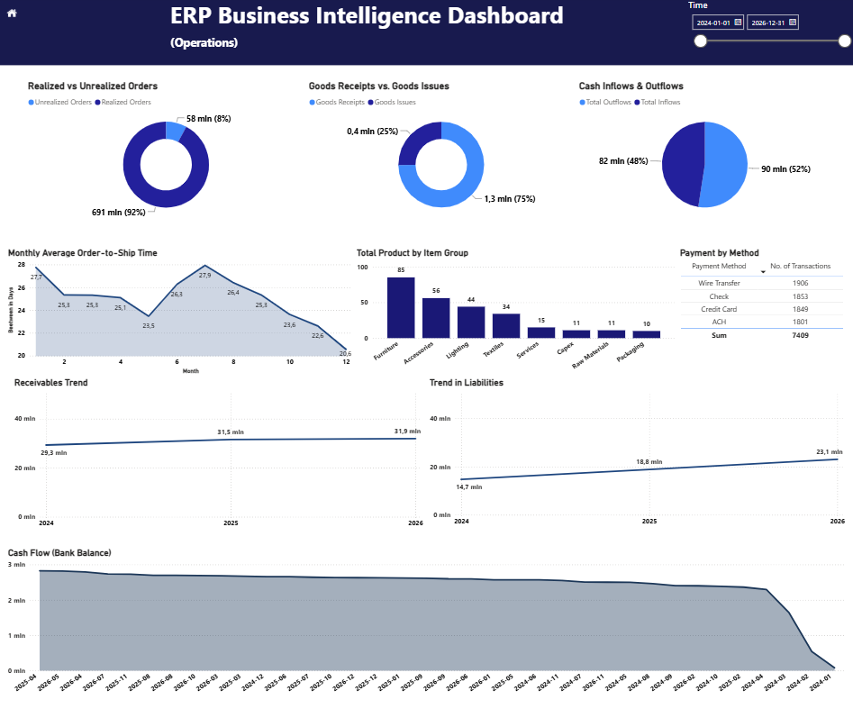

<p align="center">

# ERP Business Intelligence Solution

**End-to-End Business Intelligence Project**

SQL • SQLite • Power BI • Power Query • Excel

</p>

---

An end-to-end Business Intelligence project that simulates a realistic ERP environment by combining relational database design, SQL analytics and interactive Power BI dashboards.

> **Tech Stack:** SQL • SQLite • Power BI • Power Query • Excel

---

## 📖 Project Highlights ⭐

This project presents a complete Business Intelligence solution built around a realistic ERP environment.

It demonstrates the full analytics workflow, including:

- relational database design
- SQL development
- data transformation
- KPI calculations
- interactive dashboard development in Power BI

The solution supports business decision-making by transforming ERP data into actionable insights.

---

## 🚀 Key Features

- 📊 5 Interactive Dashboard Pages
- 📈 50+ Business KPIs
- 🗄 Relational ERP Database
- 💻 SQL-Based Data Model
- 📑 100+ SQL Queries
- 📅 3 Years of Business Data
- 📦 Finance, Sales, HR & Operations Analytics

---

## 🎯 Business Objective

The project was designed to enable users to:

- Monitor key business KPIs
- Analyze financial performance
- Track sales and purchasing activities
- Evaluate employee performance
- Monitor operational efficiency
- Support data-driven decision making

---

## 🛠 Technologies

| Technology      | Description                                              |
| --------------- | -------------------------------------------------------- |
| SQL             | Data extraction, KPI calculations and analytical queries |
| SQLite          | Relational ERP database                                  |
| Power BI        | Dashboard development and data visualization             |
| Power Query     | Data transformation and preparation                      |
| Microsoft Excel | Process automation and supporting calculations           |


---

## 📊 Dashboard Pages

The solution consists of five interactive analytical dashboards.

| Dashboard | Focus Area |
|------------|-------------|
| 🏠 Main View | Executive overview of company performance |
| 💰 Revenue & Sales | Revenue analysis, customer insights, invoice analysis and sales trends |
| 💸 Costs & Purchases | Cost structure, purchasing analysis and supplier performance |
| 👥 Employee | HR analytics, salaries, overtime and employee performance |
| ⚙️ Operations | Warehouse operations, payment analysis and operational KPIs |

---

# 🖼 Dashboard Preview

## 🏠 Main View



---

## 💰 Revenue & Sales


---

## 💸 Costs & Purchases


---

## 👥 Employee



---

## ⚙️ Operations



---

## 🗄 Database Architecture

The project is based on a normalized ERP database designed specifically for analytical purposes.


---

## 💼 Business Questions

### Financial

- How do revenue and costs change over time?
- Which cost categories have the greatest impact on profitability?
- What is the trend of receivables and liabilities?

### Sales

- Which customers generate the highest revenue?
- Which products contribute the most to sales?
- Which suppliers generate the highest purchasing costs?

### Human Resources

- Which departments generate the highest employee costs?
- How much overtime is generated by employees?

### Operations

- Which payment methods are used most frequently?
- How efficiently are warehouse operations managed?

---

## 📂 Repository Structure

```text
ERP-Business-Intelligence-Solution/
│
├── Dashboard/
│   └── ERP_Business_Intelligence_Dashboard.pbix
│
├── Database/
│   ├── ERP_Database.db
│   ├── Create_Database.sql
│   ├── Populate_Database.sql
│   └── Database_Model.png
│
├── SQL/
│   ├── Revenue_KPIs.sql
│   ├── Costs_KPIs.sql
│   ├── Employee_KPIs.sql
│   └── Operations_KPIs.sql
│
├── Images/
│   ├── Main_View.png
│   ├── Revenue.png
│   ├── Costs.png
│   ├── Employee.png
│   ├── Operations.png
│   └── Database_Model.png
│
├── Documentation/
│   └── Project_Documentation.pdf
│
└── README.md
```

---

## 🚀 How to Run the Project

1. Clone this repository.
2. Open the SQLite database.
3. Open the Power BI (.pbix) file.
4. Refresh the data model if required.
5. Explore the dashboards.

---

## 👤 Author

**Jakub Kwietniewski**

Data Analyst specializing in SQL, Power BI and ERP Analytics.

- LinkedIn: *(add your profile)*
- GitHub: *(add your profile)*

## 📄 License

This repository was created for educational and portfolio purposes.
